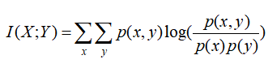

# 信息熵衍生  
## 相对熵（relative entropy）和交叉熵（cross entropy）
**相对熵又叫KL散度（Kullback-Leibler divergence），用于衡量两个概率分布的差异**，而交叉熵则是相对熵去掉一个项之后的值  
  
## 互信息（Mutual Information）

p(x,y)表示x和y的**联合概率分布**，p(x)、p(y)则分别表示x和y的**边缘概率分布**。
